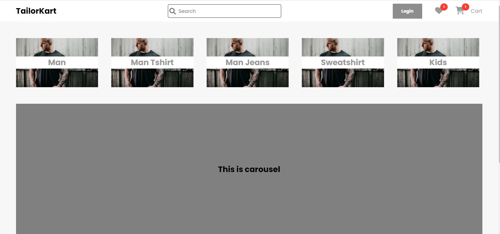
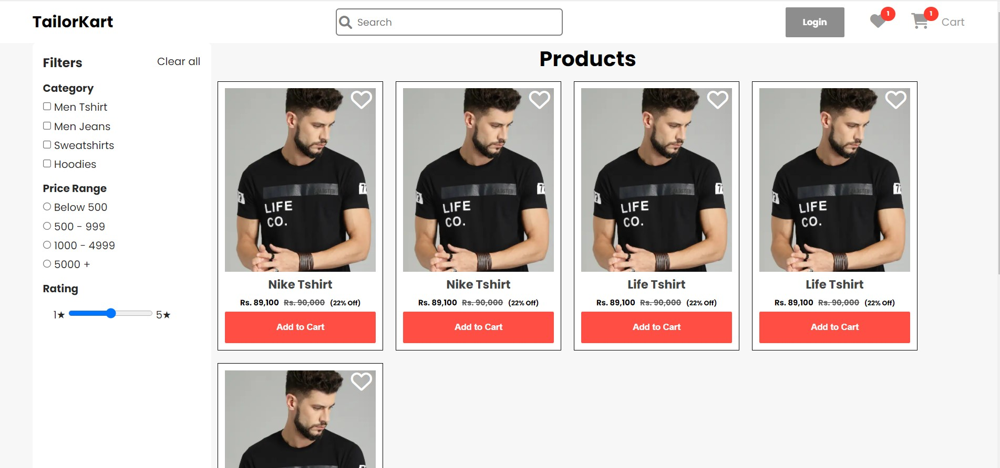
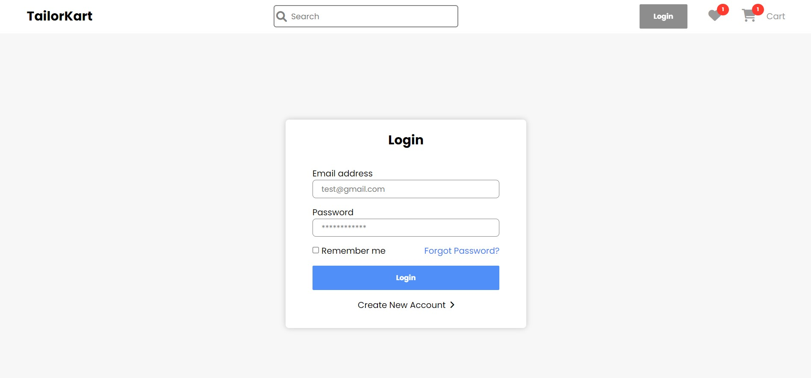

# TailorKart Ecommerce App

TailorKart is web Ecommerce application which enables users to purchase there favorite products from there fingertip.

----
## Tech Stack

**Used:** HTML, CSS, Componently Frontend Library

----

## Pages

 - [HomePage](https://tailorkart.netlify.app/)
 - [Login](https://tailorkart.netlify.app/pages/login.html)
 - [Signup](https://tailorkart.netlify.app/pages/signup.html)
 - [Products](https://tailorkart.netlify.app/pages/product.html)
 - [Wishlist](https://tailorkart.netlify.app/pages/wishlist.html)
 - [Cart](https://tailorkart.netlify.app/pages/cart.html)

----

## Screenshots
Home Page

Products

Login

----

## Authors

- [@spraveenofficial](https://www.github.com/spraveenofficial)

